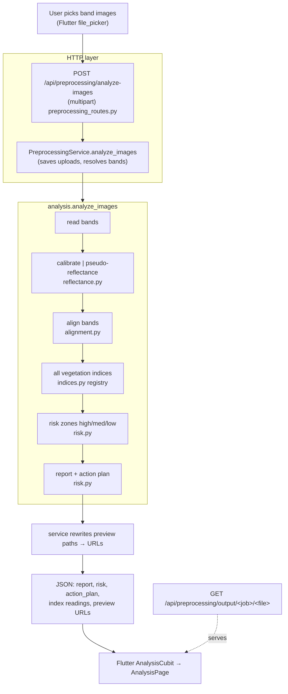
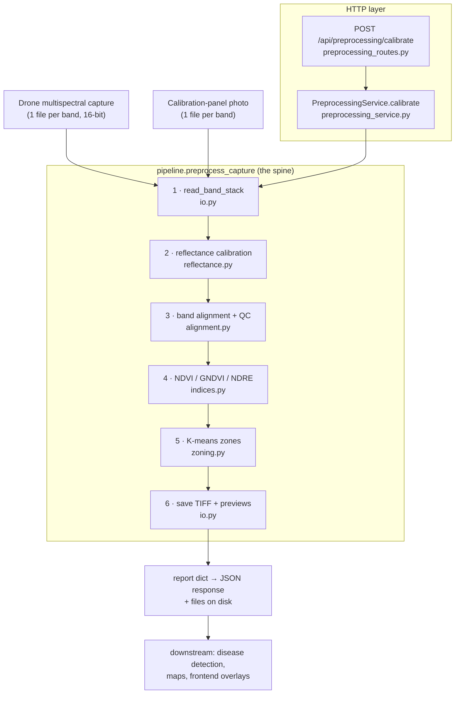
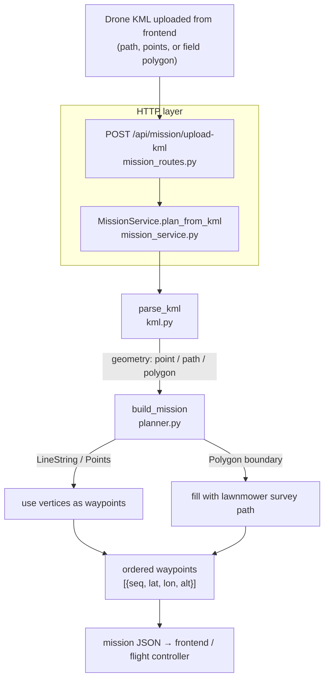

# AgriVision — Multispectral Preprocessing & Mission Data Flow

This document traces how data moves through the backend for three features:

1. **Imagery preprocessing** — raw multispectral drone captures → reflectance →
   aligned bands → NDVI / GNDVI / NDRE → low/medium/high management zones.
2. **Image analysis (no drone)** — band images picked from the system →
   indices → high/medium/low **risk** zones → field report → action plan.
3. **Mission planning** — an uploaded drone **KML** → ordered flight waypoints.

The code is annotated with `# [DATA FLOW N]` comments that correspond to the
numbered stages below, so you can jump between this document and the source.

---

## 0. Image analysis pipeline (the "no drone yet" flow)

Used by the Flutter app when the user picks images from disk instead of flying.
Calibration is **optional**: with a panel photo it produces true reflectance,
without one it uses a shared-scale pseudo-reflectance (relative but valid for
indices/risk).



| Stage | Input | Transform | Output | Where |
|-------|-------|-----------|--------|-------|
| Upload | multipart files | save per-job, resolve which file is which band (explicit `band_map` or filename auto-detect) | `{band: path}` | [preprocessing_service.py](../app/services/preprocessing_service.py) |
| Reflectance | raw bands (+ optional panel) | panel calibration **or** shared-scale pseudo-reflectance | reflectance stack | [reflectance.py](../app/preprocessing/reflectance.py) `pseudo_reflectance` |
| Align | reflectance stack | co-register bands | aligned stack | [alignment.py](../app/preprocessing/alignment.py) |
| Indices | aligned stack | every registry index the bands support | index maps + stats | [indices.py](../app/preprocessing/indices.py) `INDEX_REGISTRY` |
| Risk | primary index map | K-means → high/med/low **risk** (low vigor = high risk) + stoplight map | zones + distribution | [risk.py](../app/preprocessing/risk.py) `risk_zones` |
| Report | indices + risk | health score, flags, index summaries | report dict | [risk.py](../app/preprocessing/risk.py) `generate_report` |
| Action plan | report + risk | prioritised agronomic recommendations | action list | [risk.py](../app/preprocessing/risk.py) `generate_action_plan` |

The vegetation-index registry (`indices.INDEX_REGISTRY`) currently holds 21
indices across greenness, chlorophyll, soil-adjusted, stress, water and RGB-only
families — each with its formula, required bands, and whether a high value means
healthy or stressed (which is what drives the risk mapping).

---

## 1. Imagery preprocessing

### 1.1 High-level flow



### 1.2 Stage-by-stage

| # | Stage | Input | Transform | Output | Where |
|---|-------|-------|-----------|--------|-------|
| 1 | **Load** | `{band: path}` for scene + panel | decode 16-bit TIFF, keep band order, equalise shapes | two `BandStack` (raw DN, `n×H×W`) | [io.py](../app/preprocessing/io.py) `read_band_stack` |
| 2 | **Reflectance calibration** | raw DN stacks + panel reflectance | dark-subtract, (optional) exposure/gain normalise; measure mean panel signal in ROI → per-band scale `F = ρ_panel / signal`; `reflectance = F × DN` | reflectance `BandStack` (0..1) | [reflectance.py](../app/preprocessing/reflectance.py), panel ROI via [panel.py](../app/preprocessing/panel.py) |
| 3 | **Band alignment + QC** | reflectance stack | co-register every band to the reference band with pyramid **ECC** (ORB fallback, identity if neither helps); crop to common overlap; score edge agreement | aligned reflectance `BandStack` + `alignment` report (`aligned_cleanly`, per-band scores) | [alignment.py](../app/preprocessing/alignment.py) `align_stack` |
| 4 | **Vegetation indices** | aligned reflectance stack | normalized-difference ratios (see below) | float32 index maps `[-1,1]` + stats + preview PNG | [indices.py](../app/preprocessing/indices.py) `compute_indices` |
| 5 | **Management zones** | one index map (default NDVI) | K-means (k=3), clusters **re-ordered by mean** so labels are low→high | zone label map + per-zone area/center + colored preview | [zoning.py](../app/preprocessing/zoning.py) `zone_index_map` |
| 6 | **Persist** | aligned stack + index/zone maps | write reflectance TIFFs, false-colour + index/zone previews | files under `output_dir/` | [io.py](../app/preprocessing/io.py) `save_stack`, `save_false_color` |

Index definitions (all computed on **reflectance**, never raw DN):

```
NDVI  = (NIR − Red)     / (NIR + Red)      canopy greenness / biomass
GNDVI = (NIR − Green)   / (NIR + Green)    chlorophyll / nitrogen status
NDRE  = (NIR − RedEdge) / (NIR + RedEdge)  stress in dense / mature canopy
```

### 1.3 What flows between stages (types)

```
band_paths ─┐
            ├─► BandStack(raw DN) ─► BandStack(reflectance) ─► BandStack(aligned)
panel_paths ┘        (io)               (reflectance)             (alignment)
                                                                      │
                          ┌───────────────────────────────────────────┤
                          ▼                                            ▼
                   index maps float32[-1,1]                     zone_map uint8 (0..k-1, 255=no-data)
                          │                                            │
                          └──────────────► report dict ◄──────────────┘
```

`BandStack` (see [io.py](../app/preprocessing/io.py)) is the core carrier:
`data` of shape `(n_bands, H, W)` float32 + `band_names`. It is created once at
load and re-created (never mutated in place) by each stage, so every stage's
input/output is explicit.

### 1.4 The report dict (what the API returns)

```jsonc
{
  "status": "ok",
  "bands": ["blue","green","red","red_edge","nir"],
  "reflectance_scale": { "blue": { "scale": 1.66e-5, "panel_signal": 30000, ... }, ... },
  "alignment": {
    "reference_band": "green",
    "aligned_cleanly": true,           // ← "do the bands line up cleanly?"
    "min_score": 0.99, "mean_score": 0.99,
    "per_band": { "nir": { "method": "ecc", "score_before": 0.40, "score_after": 0.99 }, ... }
  },
  "indices": { "ndvi": { "stats": {...}, "tiff": "...", "preview": "..." }, ... },
  "zones":   { "k": 3, "zones": [ {"label":"low", "area_fraction":0.35, ...}, ... ] },
  "outputs": { "bands": {...}, "preview": "false_color_preview.png" }
}
```

---

## 2. Mission planning (KML → waypoints)



| Stage | Input | Transform | Output | Where |
|-------|-------|-----------|--------|-------|
| Parse | KML text | namespace-agnostic XML parse of `Point` / `LineString` / `Polygon` `<coordinates>` (lon,lat,alt) | `{placemarks, counts}` | [kml.py](../app/mission/kml.py) `parse_kml` |
| Plan | parsed geometry | **Path/Points** → use vertices in order. **Polygon** → project to local metres, fill with boustrophedon lines at `line_spacing_m` | `{waypoints, waypoint_count, distance_m}` | [planner.py](../app/mission/planner.py) `build_mission` |

The drone then follows `mission.waypoints` (ordered `seq`, with `lat/lon/alt`).

---

## 3. HTTP surface

| Method | Path | Purpose |
|--------|------|---------|
| `GET`  | `/api/preprocessing/health`  | Capabilities + available orthomosaic engine |
| `POST` | `/api/preprocessing/calibrate` | Reflectance-calibrate + align + index + zone one capture |
| `POST` | `/api/preprocessing/mosaic`  | Stitch calibrated rasters into a 2-D mosaic |
| `POST` | `/api/mission/upload-kml`    | KML → ordered flight waypoints |

Blueprints are registered in [app/\_\_init\_\_.py](../app/__init__.py).

---

## 4. Navigating the code by data flow

Search the codebase for **`[DATA FLOW`** to walk the spine:

- `[DATA FLOW ENTRY]` — HTTP route where a request enters.
- `[DATA FLOW 1..6]` — the six numbered pipeline stages in
  [pipeline.py](../app/preprocessing/pipeline.py), matching §1.2 above.
- `[DATA FLOW]` (unnumbered) — hand-off points in the service layer.

Module map:

```
app/preprocessing/
  config.py      sensor / panel / alignment defaults (PipelineConfig)
  io.py          BandStack, load/save, previews          ← stage 1 & 6
  panel.py       find the calibration panel ROI          ← used by stage 2
  reflectance.py DN → reflectance                        ← stage 2
  alignment.py   band co-registration + QC score         ← stage 3
  indices.py     NDVI / GNDVI / NDRE                      ← stage 4
  zoning.py      K-means low/medium/high zones            ← stage 5
  orthomosaic.py mosaic stitching + external ODM hook     (separate entry)
  pipeline.py    orchestrates stages 1–6  (THE SPINE)
app/mission/
  kml.py         parse uploaded KML
  planner.py     geometry → ordered waypoints
app/services/    preprocessing_service.py, mission_service.py
app/api/routes/  preprocessing_routes.py, mission_routes.py
```

See also the module quick-start in
[app/preprocessing/README.md](../app/preprocessing/README.md).
